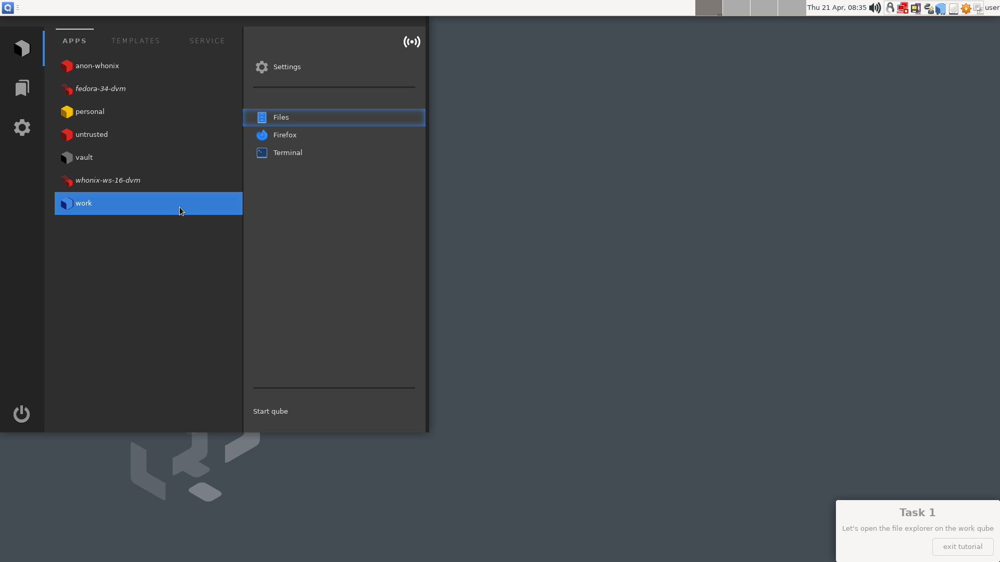
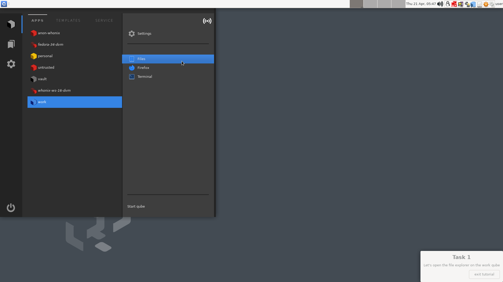
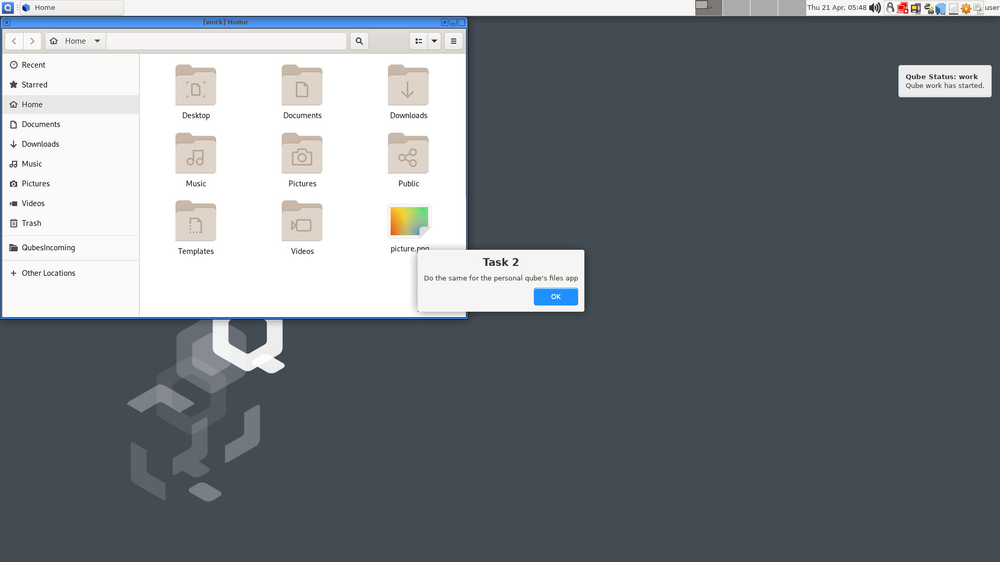
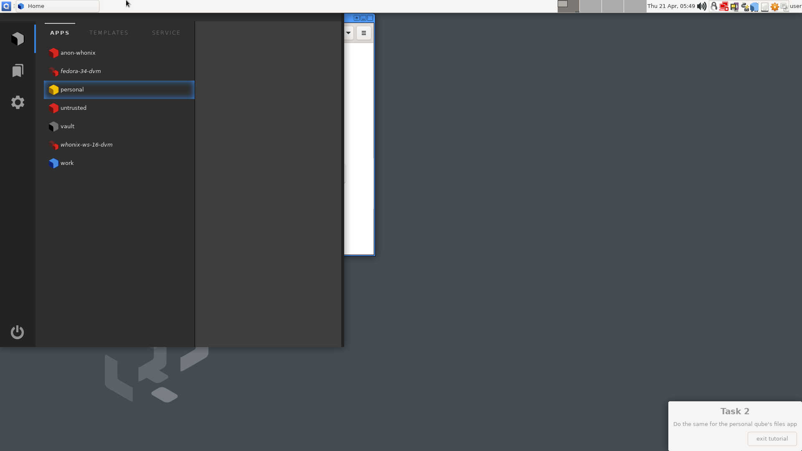
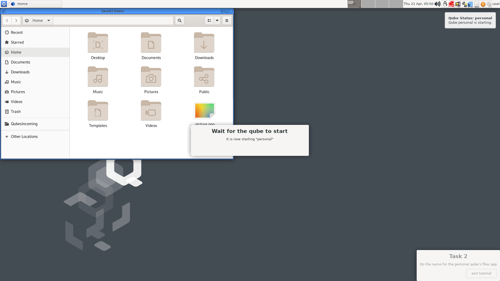
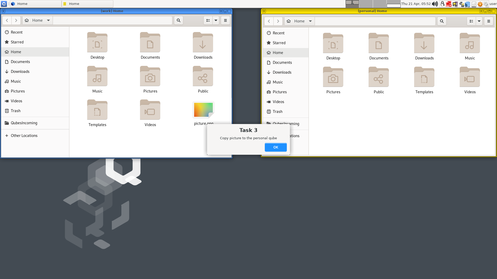
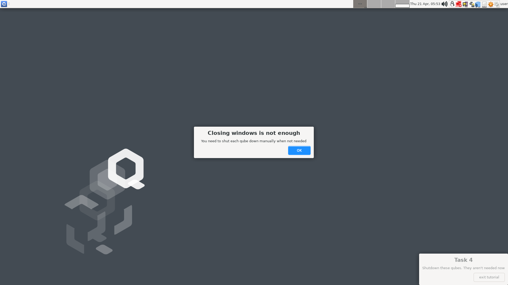
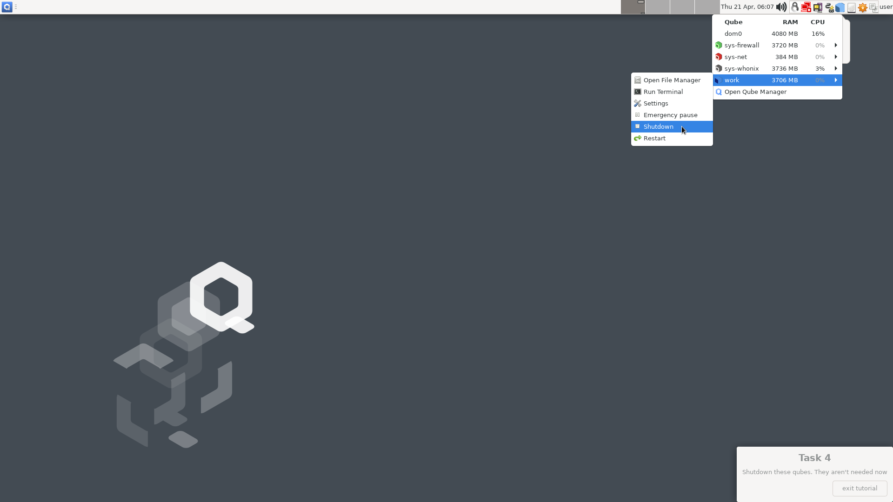

# Onboarding Tutorial Outline

Here we define the steps in the onboarding tutorial presented during the Qubes
summit 2021 ([link](https://youtube.com/watch?v=y3V_V0Vllas)).

----


```yaml
- name: "start"
  component: tutorial
  transitions:
   - interaction_type: "click main button"
     step: "step_2"
   - interaction_type: "click secondary button"
     step: "exit"
  ui:
    - type: "modal"
      template: "custom_ui/step_1.ui"
      button_label: "Learn the basics\n5 minute tutorial »"
```

---


```yaml
- name: "step_2"
  component: tutorial
  transitions:
   - interaction_type: "click main button"
     step: "step_3"
   - interaction_type: "click secondary button"
     step: "start"
  ui:
    - type: "modal"
      template: "custom_ui/step_1.ui"
      main_button_label: "I get it »"
      secondary_button_label: "<- previous"
```

---


```yaml
- name: "step_3"
  component: tutorial
  transitions:
   - interaction_type: "click main button"
     step: "step_4"
   - interaction_type: "click secondary button"
     step: "step_2"
  ui:
    - type: "modal"
      template: "custom_ui/step_3.ui"
      main_button_label: "I'm ready!"
      secondary_button_label: "<- previous"
```

---


```yaml
- name: "step_4"
  component: tutorial
  transitions:
   - interaction_type: "click main button"
     step: "step_6"
  ui:
    - type: "step_information"
      title: "Task 1"
      text: "Let's open the file explorer on the work qube"
```

---


```yaml
- name: "step_5"
  component: "Q menu"
  transitions:
   - interaction_type: "open Q menu"
     step: "step_6"
  ui:
    - type: "step_information"
      title: "Open \"Q\" menu"
      text: "To see the available qubes and their applications"
    - type: "hotspot"
      location: "top left of screen"
```

---


```yaml
- name: "step_6"
  component: Q Menu
  transitions:
   - interaction_type: "work: open files application"
     step: "step_7"
```

---



(pseudo transiton)

---



(pseudo transiton)

---


```yaml
- name: "step_9"
  component: extension
  transitions:
   - interaction_type: "work: domain UI started"
     step: "step_10"
  ui:
    - type: "step_information"
      title: "Wait for the qube to start..."
      text: "Starting a qube is like starting a computer. It takes some seconds."
```

---



```yaml
- name: "step_10"
  component: tutorial
  transitions:
   - interaction_type: "click OK"
     step: "step_11"
  ui:
    - type: "step_information"
      title: "Task 2"
      text: "Do the same for the personal qube's files app"
```

---


```yaml
- name: "step_11"
  component: extension
  transitions:
   - interaction_type: "open Q menu"
     step: "step_12"
  ui:
    - type: "step_information"
      title: "Open \"Q\" menu"
      text: "To see the available qubes and their applications"
    - type: "hotspot"
      location: "top left of screen"
```

---



```yaml
- name: "step_12"
  component: Q Menu
  transitions:
   - interaction_type: "personal: open files application"
     step: "step_15"
  ui: False
```

---


(pseudo-interaction)

---


(pseudo-interaction)

---



```yaml
- name: "step_15"
  component: extension
  transitions:
   - interaction_type: "personal domain started"
     step: "step_16"
  ui:
    - type: "step_information"
      title: "Wait for the qube to start"
      text: "It is now starting \"personal\""
```

---


```yaml
- name: "step_16"
  component: tutorial
  transitions:
   - interaction_type: "click OK"
     step: "step_17"
  ui:
    - type: "step_information"
      title: "Each qube is isolated"
      text: "As you can see, each qube has its own files"
```

---


```yaml
- name: "step_17"
  component: tutorial
  transitions:
   - interaction_type: "click primary button"
     step: "step_18"
  ui:
    - type: "modal"
      template: "custom_ui/step_17.ui"
      button_label: "I understand"
```

---



```yaml
- name: "step_18"
  component: tutorial
  transitions:
   - interaction_type: "click OK"
     step: "step_19"
  ui:
    - type: "step_information"
      title: "Task 3"
      text: "Copy picture to the personal qube"
```

---


```yaml
- name: "step_19"
  component: vm
  vm: work
  transitions:
   - interaction_type: "right click coordinates"
     step: "step_20"
  ui:
    - type: "step_information"
      text: "right click picture"
      image: "right click picture"
```

---


```yaml
- name: "step_20"
  component: "qrexec-gui"
  transitions:
   - interaction_type: "qrexec-gui opened"
     step: "step_21"
  ui:
    - type: "step_information"
      text: "copy to other AppVM"
      image: "right click picture"
```

---


```yaml
- name: "step_21"
  component: tutorial
  transitions:
   - interaction_type: "click button"
     step: "step_22"
  ui:
    - type: "modal"
      template: "custom_ui/step_21.ui"
      button_lable: "OK »"
```

---


```yaml
- name: "step_22"
  component: Qrexec Admin Prompt
  transitions:
   - interaction_type: "Qrexec: approved to personal"
     step: "step_24"
  ui:
    - type: "step_information"
      title: "\"personal\" as target"
      text: "Select the qube to which you wish to copy"
```

---


(pseudo-step)

---


```yaml
- name: "step_24"
  component: Qrexec Admin Prompt
  vm: personal
  transitions:
   - interaction_type: "QubesIncoming exists in personal"
     step: "step_26"
  ui: False
```
---


(pseudo-step)

---


```yaml
- name: "step_26"
  component: tutorial
  transitions:
   - interaction_type: "click OK"
     step: "step_27"
  ui:
    - type: "step_information"
      title: "File has been copied"
      text: The file lands in the folder "QubesIncoming."
```

---


```yaml
- name: "step_27"
  component: tutorial
  transitions:
   - interaction_type: "click OK"
     step: "step_28"
  ui:
    - type: "step_information"
      title: "Task 4 (last one)"
      text: "Shutdown these qubes. They aren't needed now"
```

---


```yaml
- name: "step_28"
  component: dom0 windows
  transitions:
   - interaction_type: "work: close all windows"
     step: "step_29"
  ui:
    - type: "step_information"
      title: "close all the windows"
      text: "Now let's close it all, since we don't need it anymore"
    - type: "hotspot"
      location: "over work window close button"
```

---


```yaml
- name: "step_29"
  component: dom0
  transitions:
   - interaction_type: "work: close all windows"
     step: "step_30"
  ui:
    - type: "step_information"
      title: "close all the windows"
      text: "Now let's close it all, since we don't need it anymore"
    - type: "hotspot"
      location: "over personal window close button"
```

---



```yaml
- name: "step_30"
  component: tutorial
  transitions:
   - interaction_type: "click OK"
     step: "step_31"
  ui:
    - type: "step_information"
      title: "Closing windows is not enough"
      text: "You need to shut each qube down manually when not needed"
```

---


```yaml
- name: "step_31"
  component: dom0
  transitions:
   - interaction_type: "open Qubes Domains"
     step: "step_31.1"
  ui:
    - type: "step_information"
      title: "Shutdown the qubes"
      text: "Shutdown \"personal\""
    - type: "hotspot"
      location: "Qubes Domains widget"
```

---


```yaml
- name: "step_31.1"
  component: dom0
  transitions:
   - interaction_type: "personal shut down"
     step: "step_31.2"
  ui:
    - type: "step_information"
      title: "Shutdown the qubes"
      text: "Shutdown \"personal\""
```

---


```yaml
- name: "step_32"
  component: dom0
  transitions:
    - interaction_type: "open Qubes Domains"
      step: "step_32.1"
  ui:
    - type: "step_information"
      title: "Shutdown the qubes"
      text: "Shutdown \"personal\""
    - type: "hotspot"
      location: "Qubes Domains widget"
```

---


```yaml
- name: "step_32.1"
  component: Qubes Domains
  transitions:
   - interaction_type: "work qube shutdown"
     step: "end"
  ui:
    - type: "step_information"
      title: "Shutdown the qubes"
      text: "Shutdown \"personal\""
```

---


---


---


---


---


---
