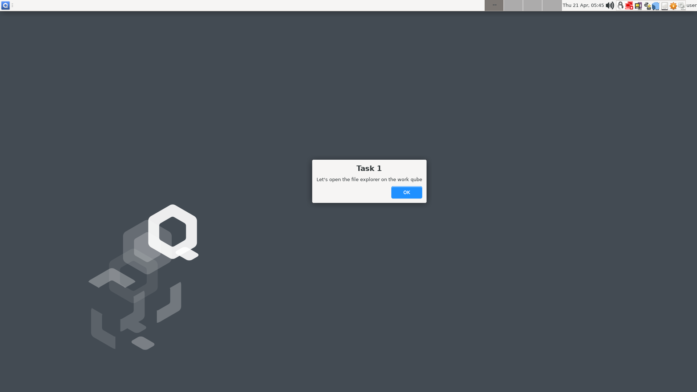
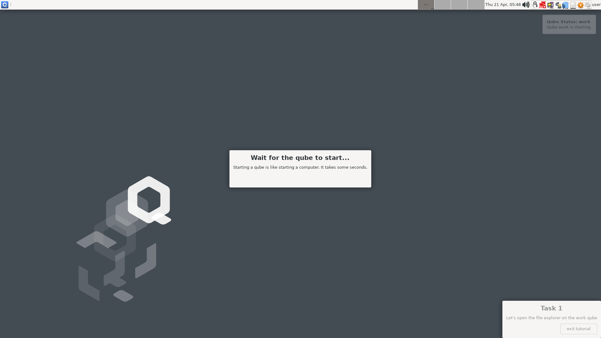
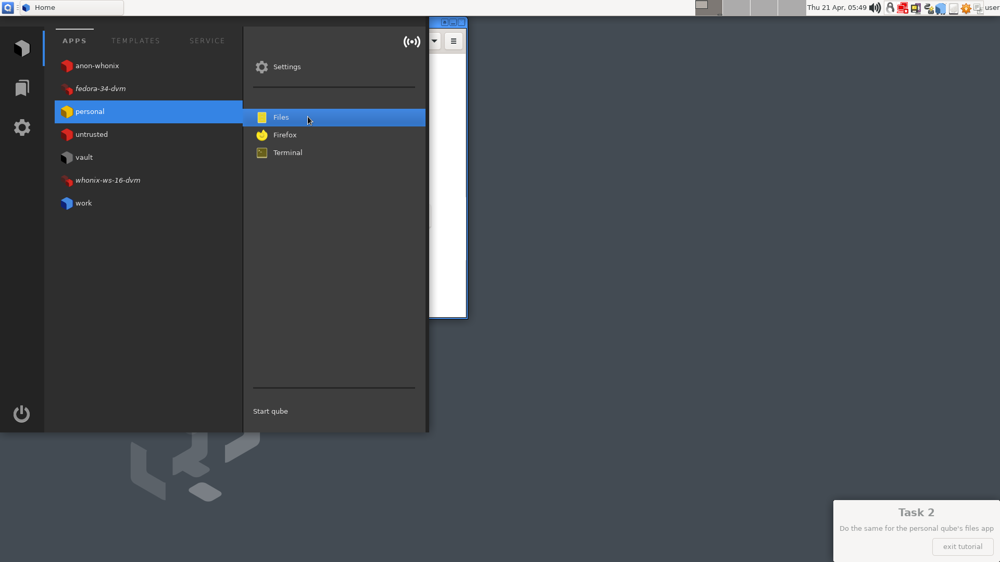
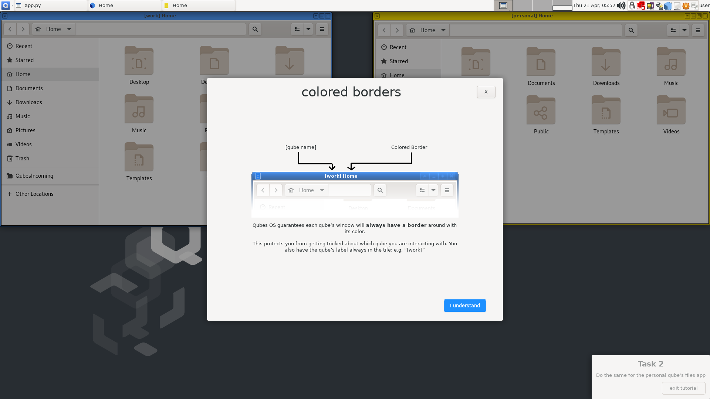
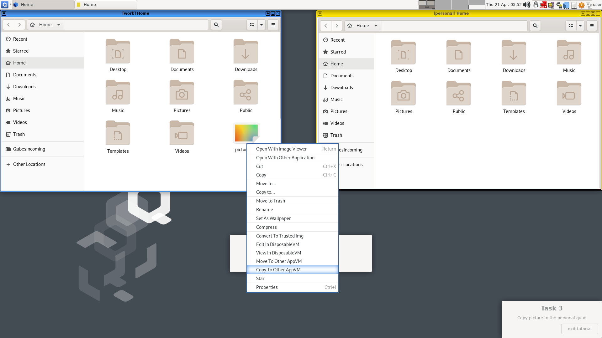
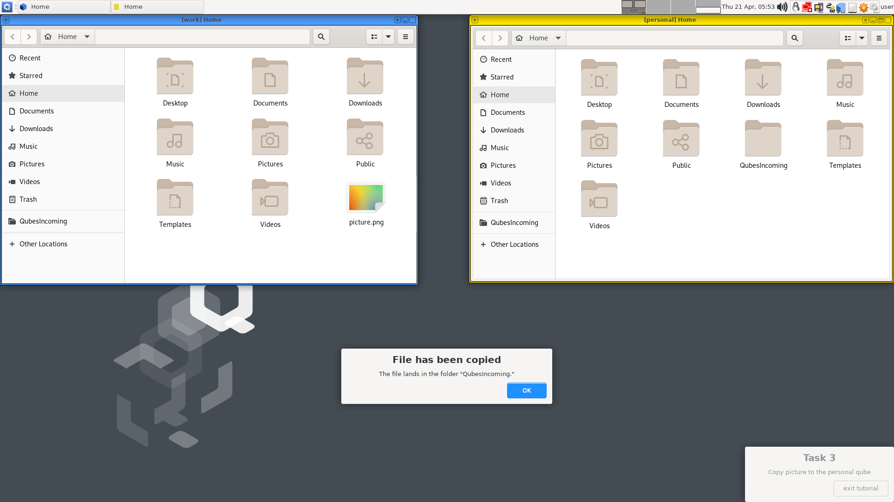
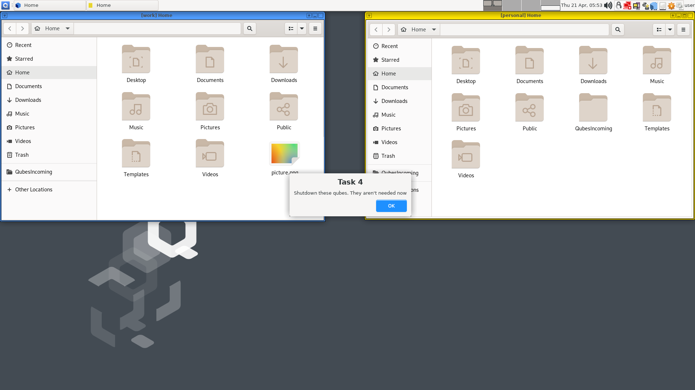
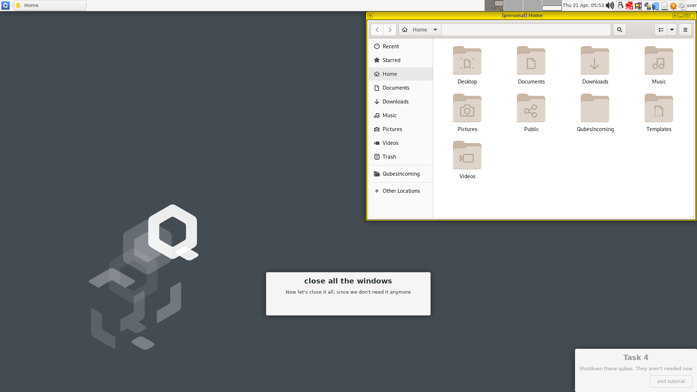
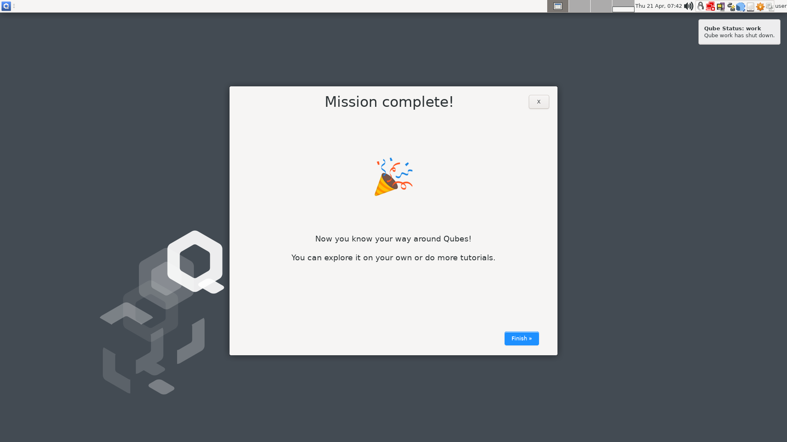

# Onboarding Tutorial Outline

Here we define the steps in the onboarding tutorial presented during the Qubes
summit 2021 ([link](https://youtube.com/watch?v=y3V_V0Vllas)).

----


```yaml
- name: "start"
  transitions:
   - interaction: "tutorial:next"
     step: "step_2"
   - interaction: "tutorial:back"
     step: "end"
  ui:
    - type: "modal"
      title: ""
      template: "custom_ui/step_1.ui"
      next_button: "Learn the basics\n5 minute tutorial »"
      back_button: "Skip tutorial,\ndo later"
```

---


```yaml
- name: "step_2"
  transitions:
   - interaction: "tutorial:next"
     step: "step_3"
   - interaction: "tutorial:back"
     step: "start"
  ui:
    - type: "modal"
      title: "Compartments you start with"
      template: "custom_ui/step_2.ui"
      next_button: "I get it »"
      back_button: "‹ previous"
```

---


```yaml
- name: "step_3"
  transitions:
   - interaction: "tutorial:next"
     step: "step_4"
   - interaction: "tutorial:back"
     step: "step_2"
  ui:
    - type: "modal"
      title: "Your mission"
      template: "custom_ui/step_3.ui"
      next_button: "I'm ready!"
      back_button: "‹ previous"
```

---



```yaml
- name: "step_4"
  transitions:
   - interaction: "tutorial:next"
     step: "step_5"
  ui:
    - type: "current_task"
      task_number: "1"
      task_description: "Let's open the file explorer on the work qube"
```

---


```yaml
- name: "step_5"
  transitions:
   - interaction: "qubes-menu:open"
     step: "step_6"
  ui:
    - type: "step_information"
      title: "Open \"Q\" menu"
      text: "To see the available qubes and their applications"
      has_ok_btn: "False"
    #- type: "hotspot"
    #  location: "top left of screen"
```

---


```yaml
- name: "step_6"
  setup:
    - type: "qubes-menu-highlight"
      vm_name: "work"
      app_name: "Files"
      override_exec:
        - "qvm-run -q work 'rm -r QubesIncoming/dom0/included_tutorials/'"
        - "qvm-copy-to-vm work /usr/share/qubes/tutorial/included_tutorials/"
        - "qvm-run -q work 'touch note.txt'"
  transitions:
   - interaction: "qubes-menu:work:Files"
     step: "step_9"
  teardown:
    - type: "qubes-menu-remove-highlight"
```

---


(pseudo transiton)

---


(pseudo transiton)

---




```yaml
- name: "step_9"
  transitions:
   - interaction: "qubes-events:work:domain-start"
     step: "step_10"
  ui:
    - type: "step_information"
      title: "Wait for the qube to start..."
      text: "Starting a qube is like starting a computer. It takes some seconds."
      has_ok_btn: "False"
  #teardown:
  #  - type: "wait" # wait for some seconds for the UI to show
  #    time: "3"
```

---


```yaml
- name: "step_10"
  transitions:
   - interaction: "tutorial:next"
     step: "step_11"
  ui:
    - type: "current_task"
      task_number: "2"
      task_description: "Do the same for the personal qube's files app"
```

---


```yaml
- name: "step_11"
  transitions:
   - interaction: "qubes-menu:open"
     step: "step_12"
  ui:
    - type: "step_information"
      title: "Open \"Q\" menu"
      text: "To see the available qubes and their applications"
      has_ok_btn: "False"
    #- type: "hotspot"
    #  location: "top left of screen"
```

---


```yaml
- name: "step_12"
  setup:
    - type: "qubes-menu-highlight"
      vm_name: "personal"
      app_name: "Files"
  transitions:
   - interaction: "qubes-menu:personal:Files"
     step: "step_15"
  teardown:
    - type: "qubes-menu-remove-highlight"

```

---


(pseudo-interaction)

---



(pseudo-interaction)

---


```yaml
- name: "step_15"
  transitions:
    - interaction: "qubes-events:personal:domain-start"
      step: "step_16"
  ui:
    - type: "step_information"
      title: "Wait for the qube to start"
      text: "It is now starting \"personal\""
      has_ok_btn: "False"
  #teardown:
  #  - type: "wait" # wait for some seconds for the UI to show
  #    time: "3"
```

---


```yaml
- name: "step_16"
  transitions:
   - interaction: "tutorial:next"
     step: "step_17"
  ui:
    - type: "step_information"
      title: "Each qube is isolated"
      text: "As you can see, each qube has its own files"
      has_ok_btn: "True"
```

---




```yaml
- name: "step_17"
  transitions:
   - interaction: "tutorial:next"
     step: "step_18"
  ui:
    - type: "modal"
      title: "colored borders"
      template: "custom_ui/step_17.ui"
      next_button: "I understand"
      back_button: ""
```

---


```yaml
- name: "step_18"
  transitions:
   - interaction: "tutorial:next"
     step: "step_21"
  ui:
    - type: "current_task"
      task_number: "3"
      task_description: "Copy picture to the personal qube"
```

---


```[disabled]yaml
- name: "step_19"
  transitions:
    # user right-clicks
    - interaction: "vm-interaction:work"
      step: "step_20"
  ui:
    - type: "step_information"
      text: "right click picture"
      image: "right click picture"
```

---



```[disabled]yaml
- name: "step_20"
  transitions:
   - interaction: "qrexec-gui:opened"
     step: "step_21"
  ui:
    - type: "step_information"
      text: "copy to other AppVM"
      image: "right click picture"
```

---


```yaml
- name: "step_21"
  transitions:
   - interaction: "tutorial:next"
     step: "step_22"
  ui:
    - type: "modal"
      title: "Administrator prompt"
      template: "custom_ui/step_21.ui"
      next_button: "OK »"
      back_button: ""
```

---


```yaml
- name: "step_22"
  transitions:
   - interaction: "qubes-qrexec-qubes.Filecopy+:work:personal"
     step: "step_26"
  ui:
    - type: "step_information"
      title: "\"personal\" as target"
      text: "Select the qube to which you wish to copy"
      has_ok_btn: "True"
```

---


(pseudo-step)

---


```[disabled]yaml
- name: "step_24"
  transitions:
    # wait for file to be copied
    - interaction: "tutorial:small-time-wait"
   #- interaction: "QubesIncoming exists in personal"
      step: "step_26"
  ui: False
```
---


(pseudo-step)

---



```yaml
- name: "step_26"
  transitions:
   - interaction: "tutorial:next"
     step: "step_27"
  ui:
    - type: "step_information"
      title: "File has been copied"
      text: The file lands in the folder "QubesIncoming."
      has_ok_btn: "True"
```

---



```yaml
- name: "step_27"
  transitions:
   - interaction: "tutorial:next"
     step: "step_30"
  ui:
    - type: "current_task"
      task_number: "4"
      task_description: "Shutdown these qubes. They aren't needed now"

```

---


```[disabled]yaml
- name: "step_28"
  transitions:
   - interaction: "qubes-guid:work:close-all-windows"
     step: "step_29"
  ui:
    - type: "step_information"
      title: "close all the windows"
      text: "Now let's close it all, since we don't need it anymore"
    - type: "hotspot"
      location: "over work window close button"
```

---



```[disabled]yaml
- name: "step_29"
  transitions:
   - interaction: "qubes-guid:personal:close-all-windows"
     step: "step_30"
  ui:
    - type: "step_information"
      title: "close all the windows"
      text: "Now let's close it all, since we don't need it anymore"
    - type: "hotspot"
      location: "over personal window close button"
```

---


```yaml
- name: "step_30"
  transitions:
   - interaction: "tutorial:next"
     step: "end"
  ui:
    - type: "step_information"
      title: "Closing windows is not enough"
      text: "You need to shut each qube down manually when not needed"
      has_ok_btn: "True"
```

---


```[disabled]yaml
- name: "step_31"
  transitions:
   - interaction: "qubes-domains:open"
     step: "step_31.1"
  ui:
    - type: "step_information"
      title: "Shutdown the qubes"
      text: "Shutdown \"personal\""
    - type: "hotspot"
      location: "Qubes Domains widget"
```

---


```[disabled]yaml
- name: "step_31.1"
  transitions:
   - interaction: "qubes-events:personal:domain-shutdown"
     step: "step_31.2"
  ui:
    - type: "step_information"
      title: "Shutdown the qubes"
      text: "Shutdown \"personal\""
```

---


```[disabled]yaml
- name: "step_32"
  transitions:
    - interaction: "qubes-domains:open"
      step: "step_32.1"
  ui:
    - type: "step_information"
      title: "Shutdown the qubes"
      text: "Shutdown \"personal\""
    - type: "hotspot"
      location: "Qubes Domains widget"
```

---


```[disabled]yaml
- name: "step_32.1"
  transitions:
   - interaction: "qubes-events:personal:domain-shutdown"
     step: "end"
  ui:
    - type: "step_information"
      title: "Shutdown the qubes"
      text: "Shutdown \"personal\""
```

---



---


---


---


---


---
